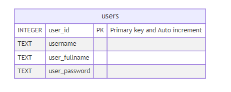

# Mock Exam - Fundamental Web Programming - Final 02/2023 - Part Practice (Lab)

---

# 1. ให้นักศึกษาทำระบบหลังบ้าน โดยมีเงื่อนไขดังนี้

ในข้อนี้จะมี 5 หน้าได้แก่ **login.php,** **register.php, logout.php,** **index.php, manage.php**

DatabaseSchema สามารถเปลี่ยนแปลงตามใจได้ 

## หน้า register **- (หน้าสมัครสมาชิก)**

- จะมี input ทั้งหมด 4 ตัวได้แก่
    - **ชื่อบัญชีผู้ใช้งาน** ต้องสามารถมีความยาวเกิน 3 ตัวอักษร ไม่อนุญาตให้เว้นว่าง
    - **ชื่อผู้ใช้งาน** ต้องสามารถมีความยาวเกิน 8 ตัวอักษร ไม่อนุญาตให้เว้นว่าง
    - **รหัสผ่าน** ต้องสามารถมีความยาวเกิน 8 ตัวอักษร ไม่อนุญาตให้เว้นว่าง
    - **ยืนยันรหัสผ่าน** ต้องสามารถมีความยาวเกิน 8 ตัวอักษรและต้องเหมือนรหัสผ่านข้างต้นด้วย ไม่อนุญาตให้เว้นว่าง
- หากกรอกข้อมูลครบจะต้องบันทึกลงบนฐานข้อมูล SQLite3 ได้
- หลังจากกดปุ่มสมัคร ระบบแจ้งว่าสามารถสมัครได้หรือไม่
    - หากไม่สามารถสมัครได้ ให้แจ้งไปยังว่า มีช่อง input ตัวไหนที่กรอกข้อมูลไม่ครบหรือปล่อยว่างรึเปล่า (นักศึกษาสามารถแสดงข้อความตามอัธยาศัย)
    - หากสามารถสมัครได้ให้ทำการพาไปยังหน้า login
- **(Extra point)!** หากสามารถบันทึกรหัสผ่านในรูปแบบ Encrypted ได้ ไม่ว่าจะเป็น Bcrypt, Argon2i จะได้รับคะแนนเพิ่ม 0.5 คะแนน

## หน้า **login - (เข้าสู่ระบบ)**

- จะมี input ทั้งหมด 2 ตัวได้แก่
    - **ชื่อบัญชีผู้ใช้งาน** ต้องสามารถมีความยาวเกิน 3 ตัวอักษร ไม่อนุญาตให้เว้นว่าง
    - **รหัสผ่าน** ต้องสามารถมีความยาวเกิน 8 ตัวอักษร ไม่อนุญาตให้เว้นว่าง
- หลังจากกดปุ่มเข้าสู่ระบบแล้ว ระบบต้องแจ้งได้ว่าสามารถเข้าสู่ระบบได้หรือไม่
    - หากเข้าสู่ระบบไม่ได้ให้แจ้งว่า **ไม่สามารถเข้าสู่ระบบได้ กรุณาลองใหม่อีกครั้ง**
    - หากเข้าสู่ระบบได้ ให้ดำเนินการดังนี้
        - ให้เลือกนักศึกษาเปิดใช้งานระบบ Session เพื่อเก็บข้อมูลผู้ใช้งาน โดยเก็บชื่อจริง ชื่อบัญชีผู้ใช้งาน และไอดีของบัญชีผู้ใช้งาน
        - บันทึกค่าลงไปใน Session และพาไปยังหน้า Home

## หน้า home **- (หน้าหลักของผู้ใช้งาน)**

- โดยหน้านี้จะต้องมีการล็อกอินก่อนเท่านั้น หากยังไม่ได้ล็อกอินให้พาไปยังหน้า login.php
- หน้านี้จะเป็นการแสดงข้อมูล ไอดีผู้ใช้งาน ชื่อบัญชีผู้ใช้งาน ชื่อจริง - นามสกุล
- มีปุ่มพาไปยังหน้า logout.php

## หน้า logout **- (ออกจากระบบ)**

- โดยหน้านี้จะต้องมีการล็อกอินก่อนเท่านั้น หากยังไม่ได้ล็อกอินให้พาไปยังหน้า login.php
- ให้ดำเนินการทำลาย Session ทั้งหมดแล้วพากลับไปยังหน้า login

## หน้า Manage **- (หน้าจัดการบัญชีผู้ใช้งาน)**

- โดยหน้านี้จะต้องมีการล็อกอินก่อนเท่านั้น หากยังไม่ได้ล็อกอินให้พาไปยังหน้า login.php
- ในหน้านี้จะเป็นการแสดงข้อมูลผู้ใช้งานทั้งหมด ไม่ว่าจะเป็น **ไอดีของผู้ใช้งาน, ชื่อผู้ใช้งาน, ชื่อจริงของผู้ใช้งาน, Action** โดยแสดงรูปแบบเป็นตารางเท่านั้น
- สามารถลบบัญชีของผู้ใช้งานได้
    - ก่อนลบข้อมูลแจ้งว่า confirm ที่จะลบหรือไม่ด้วย *hint: confirm method in javascript*
- มีปุ่มพาไปยังหน้า home

## รูปภาพประกอบเผื่อขี้เกียจ Design

### หน้า register.php - หน้าสมัครสมาชิก

### หน้า login.php - หน้าเข้าสู่ระบบ

### หน้า home.php - หน้าหลักของผู้ใช้งาน

### หน้า manage.php - หน้าจัดการบัญชีผู้ใช้งาน

# 2. ให้นักศึกษาดึงข้อมูลจากเว็บไซต์ [http://10.0.15.21/lab/lab12/restapis/products.php](http://10.0.15.21/lab/lab12/restapis/products.php) นี้แล้วแสดงผลตาราง โดยมีเงื่อนไขดังนี้

- ต้องเป็นการใช้รูปแบบ RESTAPI เท่านั้น **ไม่อนุญาตให้ใช้ JavaScript Fetch API**
- ต้องสามารถจำกัดการแสดงข้อมูลบนตารางได้ วิธีการจำกัดการแสดงข้อมูลจะต้องใช้ URL GET เท่านั้น
